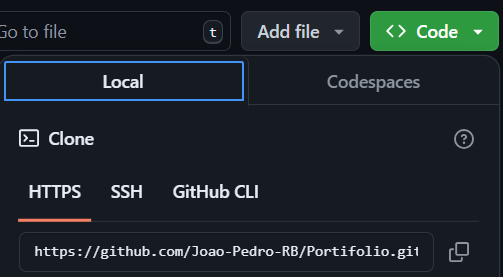
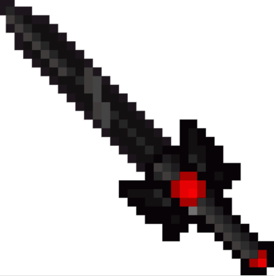
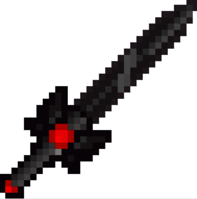

# Meu Portifólio 

<p align="center"><strong>Esse projeto se trata de um portifólio de um dev iniciante, pretendo mante-lo atualizado 100% do tempo pois quero linkar todos os meus projetos futuros no mesmo.</strong></P>

##   Visualização do portifólio  

[](https://joao-pedro-rb.github.io/Portifolio/)
_Ao clicar nele você sera imediatamente direcionado ao meu portifólio, experimente!_

### Mais oque podemos encontrar nesse projeto ?

 Aqui é onde irei atualizar frequentemente com todos os meus projetos e avanços, como iniciante na area da programação sera como um acompanhamento da minha carreira, além de todas as linguagens usadas em cada um dos projetos separados por seções.

## Como ultilizar
1. **Copie o link do projeto no GitHub.**
:<p></p>
2. **Crie uma pasta onde deseja abrir o codigo.**

3. **Na pasta criada clique no botão direito do mouse e abra com Git Bash Here.** 

4. **Em seguida use o comando**

* ```git bash
  git clone (link copiado fora do parenteses).
  ```
5. Em seguida use o comando `ls` e logo após use `cd portifólio`.

6. Após abrir o arquivo use `code . index.html` para caessar o código.

7. Agora você terá meu portifólio e poderá modifica-lo para montar o seu!.

### **Para que serve ?**
<p>Como toda proposta inicial de um portifólio, criei o meu com o intuito de atrair recrutadores que buscam devs em potencial para sua empresa, portanto não só tomei a decisão de criar um portifólio para atrai-los como tambem para ajudar outrs devs a criar o seu proprio com base em algo que tenha-o atraido do meu.


### Tecnologias ultilizadas no portifólio
 
 | Html  |  Css  | JavaScript |
 |:-------:|:-------:|:------------:|
 | |  |  | 


### **_Projetos atuais_**

1. Projeto: Em desenvolvimento...
  
##  **_Objetivo Final do Projeto_** 
<p>Servir como base para todos os futuros projetos que pretendo criar mesmo após conseguir um emprego na aréa, também tenho em mente criar projetos que visam no meu desenvolvimento por partes, por exemplo: Projeto X, nivel atual X, Tempo de estudo necessário para chegar a conclusão do projeto XX. E assim por diante, acredito que vai servir como base para outros devs iniciantes que assim como eu precisam de mais base em comclusões de projetos.